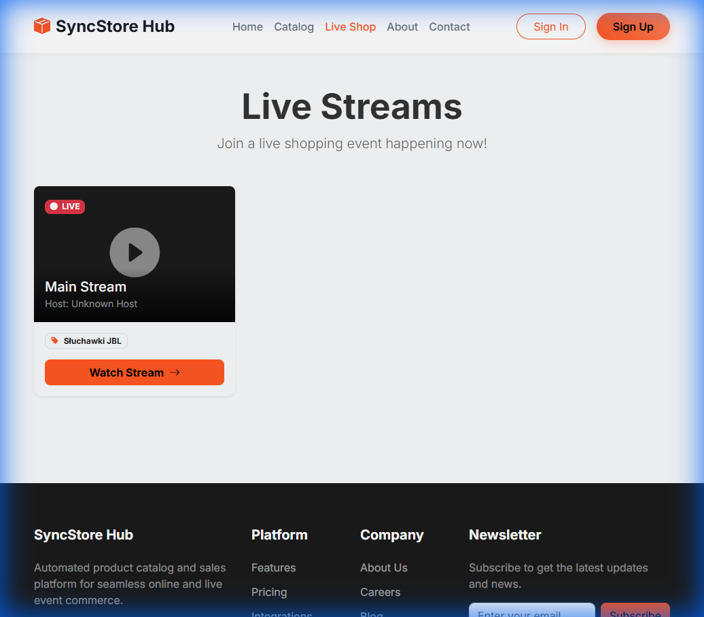
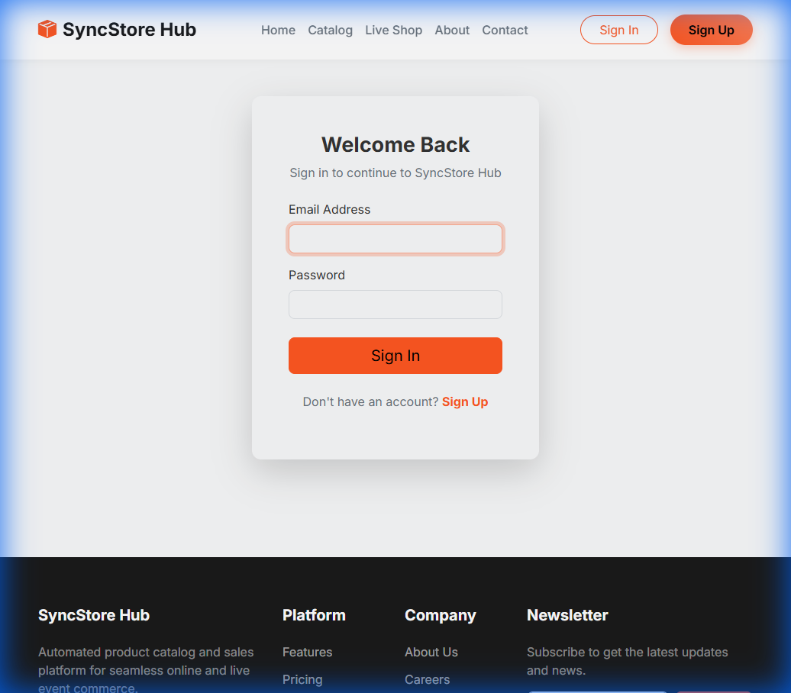
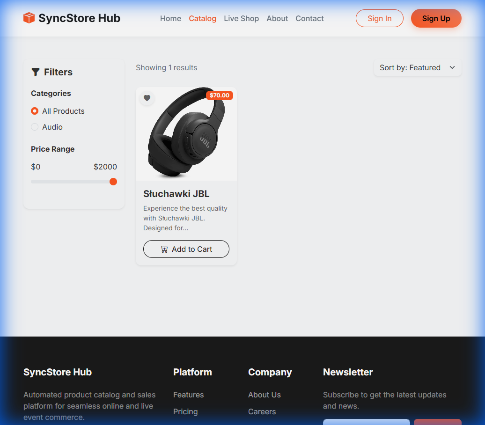
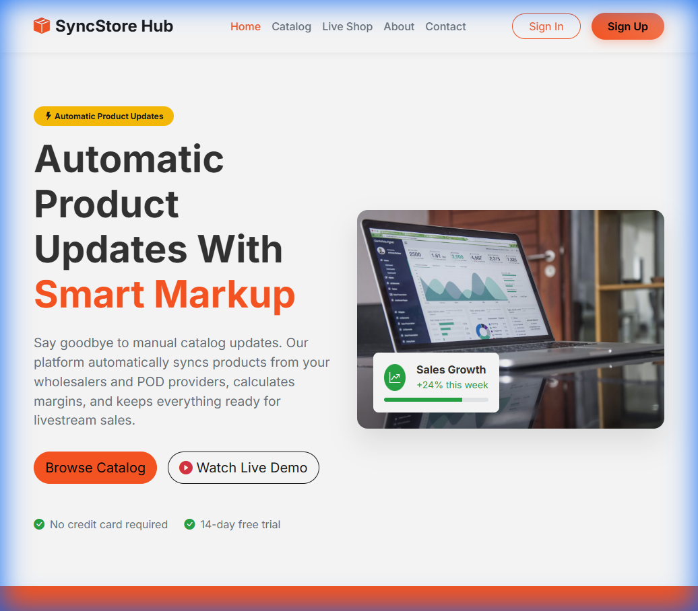

# 🛒 SyncStore-Hub
### The Future of Live Commerce

 

**SyncStore-Hub** redefines the e-commerce experience by merging the instant gratification of **Live Streaming** with the convenience of **Online Shopping**. 
 A fully interactive, real-time "Watch & Shop" platform built for the modern era.

[Explore Features](#-key-features) • [View Gallery](#-visual-gallery) • [Tech Stack](#-technology-stack) • [Roadmap](#-development-roadmap)

 

---

## 💎 Project Vision

> "Shopping shouldn't just be a transaction; it should be an event."

In a world dominated by static scroll-and-click interfaces, **SyncStore-Hub** brings the human element back to digital retail. We are building a platform where brands can tell stories, demonstrate products in real-time, and interact directly with their audience.

This isn't just a shop; it's a **broadcast network for commerce**.

---

## 🚀 Key Features

| **🔴 Live Shopping Core** | **🛠️ Admin Command Center** | **🛍️ E-Commerce Engine** |
|:---:|:---:|:---:|
| **Ultra-Low Latency** 120 FPS / 720p Streaming | **Studio Controls** Professional Broadcast Dashboard | **Smart Catalog** AJAX-Driven Filtering |
| **Dynamic Overlay** Glassmorphism UI Layer | **Magic AI Tools** Auto-Description & Pricing | **Seamless Cart** Instant "Add to Cart" Actions |
| **Gamified Bidding** Real-time Auctions & Timer | **Instant Push** Sync Products to Viewers | **Responsive Design** Mobile-First Architecture |

### 🔍 Deep Dive: The Experience

#### 👤 For the Viewer (The Shopper)
*   **Immersive Viewing**: Watch high-definition product demos without leaving the browser.
*   **Instant Gratification**: See a product you like? Click "Bid" or "Buy" instantly via the non-intrusive overlay.
*   **Social Connection**: Chat with the host and other viewers, asking questions and getting real-time answers.
*   **Thrill of the Hunt**: Participate in limited-time auctions with live countdowns that create a genuine sense of urgency.

#### 🎬 For the Host (The Admin)
*   **Total Control**: A "Mission Control" style dashboard that gives you a live feed of your camera, chat, and active inventory.
*   **AI Copilot**: Don't know what to write? Our **Magic AI** generates professional product descriptions and pricing strategies on the fly.
*   **Audience Interaction**: Highlight products on the screen with a single click, pushing them to every viewer's device instantly.

---

## 📸 Visual Gallery

### The Command Center
*A powerful dashboard for hosts to manage the stream, chat, and auctions in real-time.*

 

### Discovery & Exploration
*An immersive catalog experience with smart filters and dynamic layouts.*

 

### Live Experience
*Real-time shopping with interactive video and chat.*

 

### Home Page
*The landing page of the future of commerce.*

---

## 💻 Technology Stack

### 🏗️ Architecture Highlights

*   **Real-Time Simulation**: Custom implementation using `BroadcastChannel API` and `Web Workers` for high-performance local streaming. This allows for zero-latency testing and demonstration without expensive media server infrastructure.
*   **MVC Pattern**: Robust backend logic separated from presentation using Laravel's elegant architecture, ensuring scalability and maintainability.
*   **Blade Templating**: Dynamic, server-side rendered views for SEO-friendly and fast-loading pages, enhanced with modern CSS3 animations.

---

## 🗺️ Development Roadmap

We are constantly evolving. Here is what's next for SyncStore-Hub:

### Phase 1: Foundation (Completed) ✅
- [x] Core E-commerce Engine (Products, Cart, Catalog).
- [x] Admin Dashboard with Product Management.
- [x] Live Stream Simulation (BroadcastChannel).
- [x] Basic Auction System & Timer.

### Phase 2: Engagement (Completed) ✅
- [x] **User Profiles**: Order history, saved addresses, and wishlists.
- [x] **Advanced Chat**: Moderation tools, pinned messages, and emotes.
- [x] **Payment Integration**: Stripe/PayPal sandbox for real checkout flows.

### Phase 3: Scaling (Completed) ✅
- [x] **WebRTC Integration**: Replacing local simulation with true P2P remote streaming for global access.
- [x] **Mobile App**: A React Native wrapper to bring the experience to iOS and Android.
- [x] **AI Chatbot**: An automated moderator that answers FAQs about products during the stream.
- [x] **Multi-Host Support**: Allowing multiple streamers to broadcast simultaneously on different channels.

### Phase 4: Future Horizons (Almost-Completed) ✅
- [x] **Gamification**: Points system, leaderboards, and badges to incentivize viewer engagement.
- [x] **Advanced Analytics**: Live viewer graphs, conversion tracking, and chat heatmaps for hosts.
- [x] **Smart AI Assistant**: Context-aware shopping assistant powered by LLMs (Gemini/OpenAI).
- [x] **Social Features**: Host subscriptions, follow notifications, and social sharing.
- [x] **Picture-in-Picture**: Browse the catalog while keeping the stream visible in a floating window. (changes required)

---

*© 2025 SyncStore-Hub. Private Development Project.*
 
*Designed & Engineered by SpartaKoli with ❤️*

